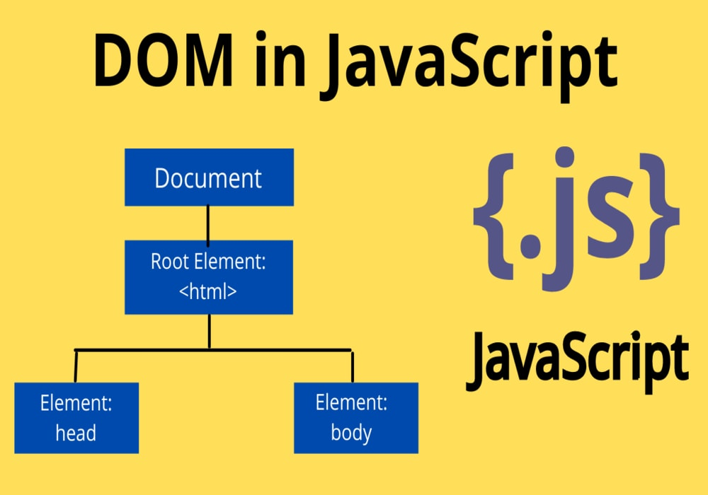
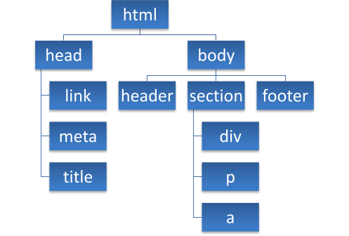
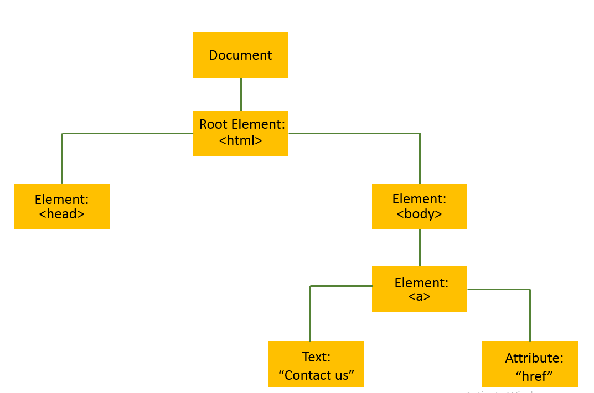

[

```
                                         Table of Contents
```
****
****
#### 1 Dom

#### 2 Introduction to browser events

#### 3 Forms, controls
****
****
## DOM
[
***
[

> DOM ба объекти ҳуҷҷат
Модели (DOM), ҳар як теги HTML як
объект аст. Тегҳои дохилшуда "фарзандони" мебошанд
иҳотакунанда. Матни даруни а
тег низ объект аст.
***
***
[
***
***
## DOM - Searching: getElement*,querySelector* - getElementById
> Дар ин боб шумо хоҳед фаҳмид, ки барои чӣ getElement* истифода мешавад ва инчунин ду усули муҳими зерин: querySelectorва querySelectorAll.

##### Document.getElementById ё Танҳо ID
> Хусусиятҳои навигатсионии DOM вақте ки онҳо ба ҳамдигар наздиканд, аъло мебошанд. Дар акси ҳол, усулҳои иловагии ҷустуҷӯ истифода мешаванд.

Яке аз онхост document.getElementById(id). Шумо метавонед онро вақте истифода баред, ки элемент атрибут дошта бошад id, новобаста аз он ки он дар куҷост.

Намунаи истифодаи document.getElementById(id)он чунин аст:
let div = document.createElement('div');
div.id = 'content';
div.innerHTML = '<p>Create Element example</p>';
document.body.appendChild(div);
document.getElementById('content').style.padding = '10px';
document.getElementById('content').style.background = 'yellow';
document.getElementById('content').style.color = 'red';
***

### Introduction to browser events
>Муносибати JavaScript бо HTML ин аст
тавассути рӯйдодҳое, ки рӯй медиҳанд, ҳал карда мешаванд
вақте ки корбар ё браузер
саҳифаро идора мекунад.
Вақте ки саҳифа бор карда мешавад, он номида мешавад
ҳодиса. Вақте ки корбар тугмаро пахш мекунад,
ки ин клик хам вокеаест. Дигар
мисолхо ходисахои монанди
пахш кардани ягон тугма, пӯшидани тиреза,
тағир додани андозаи тиреза ва ғайра.
<!DOCTYPE html>
<html>
  <head>
    <title>Title of the Document</title>
  </head>
  <body>
    <input id="inputId" type="button" value="Click">
    <script>
      inputId.onclick = function() {
        alert('Welcome to SoftClub');
      };
    </script>
  </body>
</html>

****
***

### Forms, controls

> Санҷиши формати HTML-ро тавассути JavaScript иҷро кардан мумкин аст.
Агар майдони форма (fname) холӣ бошад, ин функсия паёмро огоҳ мекунад ва бардурӯғ бармегардонад, то пешниҳоди формаро пешгирӣ кунад:
function validateForm() {
  let x = document.forms["myForm"]["fname"].value;
  if (x == "") {
    alert("Name must be filled out");
    return false;
  }
}
***
>Тасдиқи формати HTML метавонад тавассути браузер ба таври худкор анҷом дода шавад.
Агар майдони форма (fname) холӣ бошад, requiredатрибут пешниҳоди ин формаро пешгирӣ мекунад:


<form action="/action_page.php" method="post">
  <input type="text" name="fname" required>
  <input type="submit" value="Submit">
</form>


****
****
****
2
[
***
***
## createElement()
> Усули JavaScript document.createElement() ба шумо имкон медиҳад, ки а эҷод ва баргардонед
унсури нав (гиреҳи Элементи холӣ) бо номи барчасп.
> 1) createElement(elementName): Элементи html эҷод мекунад, ки тегаш аст
ҳамчун параметр гузашт. Элементи сохташударо бармегардонад
> 2) createTextNode(text): гиреҳи матниро эҷод ва бармегардонад. Матни гиреҳ аст
ҳамчун параметр гузашт.

> 1)let div = document.querySelector("div")
let but = document.createElement("button");
but.innerHTML = "BUTTON";
div.appendChild(but)
[

***
***
## The createElement() Methods
>let paragraph1 = document.createElement("p");
paragraph1.innerHTML = "This is a paragraph 1";
.
let paragraph2 = document.createElement("p");
paragraph2.innerHTML = "This is a paragraph 2";
.
let addElements = document.getElementById("myDiv")
addElements.appendChild(paragraph1)
addElements.appendChild(paragraph2)
[
***
***

## HTML DOM Element appendChild()
>Усул appendChild()гиреҳро (элементро) ҳамчун фарзанди охирини элемент замима мекунад.

##### appendChild()
>HTML
```
<div id="myDiv">
        <h2> I am myDiv</h2>
</div>
 ```
> JS 
.
let para = document.createElement("p")
let node = document.createTextNode("This is a paragraph.");
para.appendChild(node);
document.getElementById("myDiv").appendChild(para)
[

***
***
## classList()
>ClassList як қабулкунанда аст. Объекти баргардонидани он дорои якчанд усул аст:
***
classList.add("")
****
> HTML
```
<div id="myDiv"></div>
```
> JS
```
let para = document.createElement("p")
let node = document.createTextNode("This is a paragraph.");
para.classList.add("p_para");
para.appendChild(node);
document.getElementById("myDiv").appendChild(para)
```
> CSS
```
.p_para{
    font-size: 26px;
    font-weight: 900;
    color: rgb(170, 42, 42);
}
```
> [

***
***
classList.remove("")
****
> HTML
```
<div id="myDiv"></div>
```
> JS
```
let para = document.createElement("p")
let node = document.createTextNode("This is a paragraph.");
para.classList.remove("p_para");
para.appendChild(node);
document.getElementById("myDiv").appendChild(para)
```
> CSS
```
.p_para{
    font-size: 26px;
    font-weight: 900;
    color: rgb(170, 42, 42);
}
```
> [

***
***
***
## SetAtributte(
  > Усули setAttribute() ба атрибут арзиши нав мегузорад.
Агар атрибут мавҷуд набошад, он аввал сохта мешавад.
)

***
***

# JavaScript - Усулҳои HTML DOM
 [

> HTML DOM-ро бо JavaScript (ва бо забонҳои дигари барномасозӣ) дастрас кардан мумкин аст.
Дар DOM, ҳама унсурҳои HTML ҳамчун объектҳо муайян карда мешаванд .
Интерфейси барномасозӣ хосиятҳо ва усулҳои ҳар як объект мебошад.
Амвол ин арзишест, ки шумо метавонед ба даст оред ё муқаррар кунед (ба монанди тағир додани мундариҷаи элементи HTML).
Усул амалест, ки шумо метавонед иҷро кунед (ба монанди илова ё нест кардани унсури HTML) .

Example
>Намунаи зерин мундариҷаи innerHTMLэлементро <p>бо тағир медиҳад id="demo":

>HTML
```
<p id="demo"></p>
```

>JS:
```
document.getElementById("demo").innerHTML = "Hello World!"; // Hello World!
```

### The innerHTML Property (Амвол)
>Роҳи осонтарини ба даст овардани мундариҷаи элемент ин истифодаи innerHTMLмоликият мебошад.
innerHTMLАмвол барои гирифтан ё иваз кардани мундариҷаи унсурҳои HTML муфид аст .

***
***

## Errors
[
